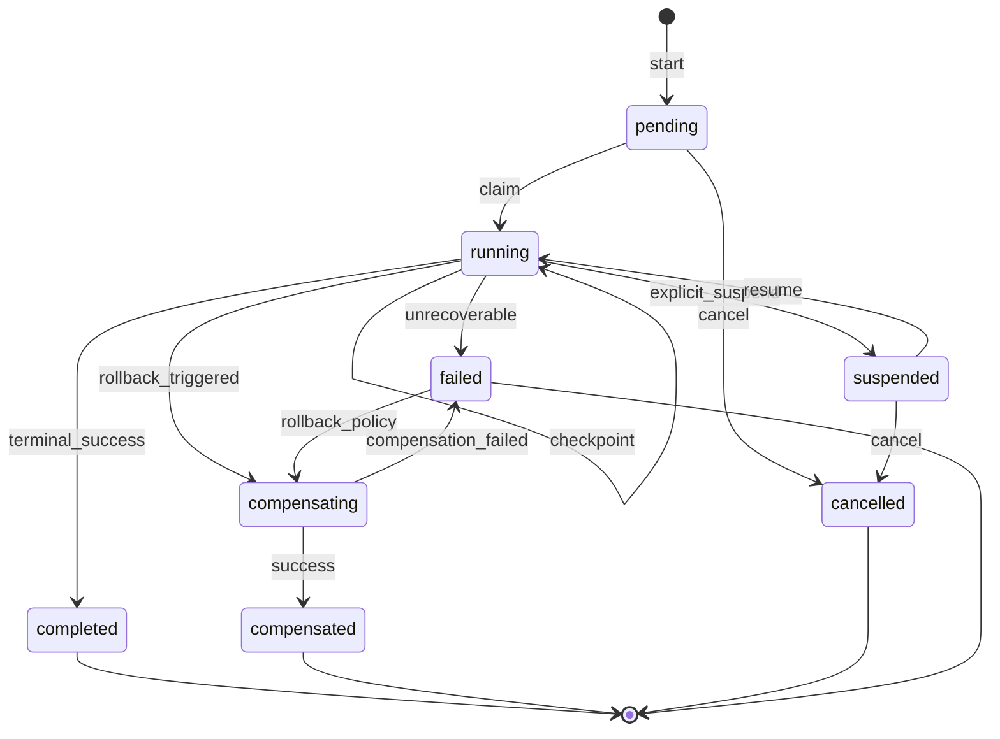
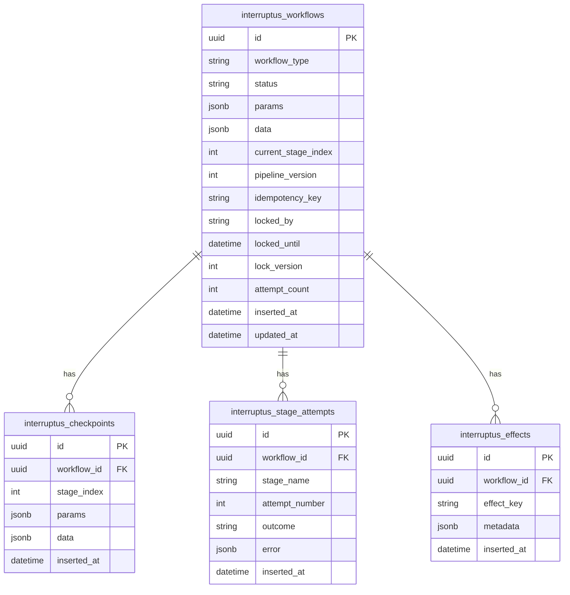

# Interruptus — Design Document

## Problem Statement

Business workflows in Elixir applications often combine multiple steps with external side effects (payments, emails, API calls). [Commandex](https://github.com/codedge-llc/commandex) provides an excellent in-process pipeline DSL but offers no durability: if the process crashes or the service restarts, work is lost and must be manually retried.

[Temporal](https://temporal.io/) solves this with a dedicated orchestration cluster, event sourcing, and activity replay. That power comes with operational complexity. Interruptus targets the middle ground: **durable Commandex-style pipelines** that run inside the host BEAM process, persist checkpoints in the host PostgreSQL database, and resume automatically after interruption—without an external orchestrator.

## Goals

1. Commandex-compatible authoring experience (`pipeline`, halt/errors) with typed `param/3` and `data/3`.
2. Checkpoint segments with idempotent `verify/1` reconciliation between boundaries.
3. Embedded persistence in the host application's database (Oban-style migrations).
4. Per-workflow-instance supervision with crash recovery.
5. Multi-node exclusivity (exactly one runner per instance cluster-wide).
6. Explicit suspend/resume for long-running or human-in-the-loop stages.
7. Configurable restart and rollback (saga) policies.

## Non-Goals (v1)

- Separate orchestration service or polyglot workers.
- Child workflow composition, cron scheduling, visual workflow designer.
- Exactly-once delivery guarantees without user-provided idempotency.
- SQLite or non-PostgreSQL storage (PostgreSQL first; adapter trait for future).

## Comparison

| Feature | Commandex | Oban | Temporal | Continuum / gen_durable | Interruptus |
|---------|-----------|------|----------|-------------------------|-------------|
| Pipeline DSL | Yes | No (jobs) | Activities/workflows | FSM / workflow code | Yes (Commandex-like) |
| Durability | No | Per-job | Full event history | Step/segment persistence | Checkpoint segments |
| In-process | Yes | Worker process | No (gRPC) | Yes (BEAM) | Yes (BEAM) |
| External verify/reconcile | No | No | Activity heartbeats | Varies | Per-checkpoint `verify/1` |
| Suspend/resume | No | No | Signals/timers | Await/signals | Explicit suspend API |
| Multi-node safety | N/A | FOR UPDATE SKIP LOCKED | Server-side | Lease + fencing | Row claim + heartbeat |
| Embedded DB | No | Yes | No | Yes | Yes |

## Core Concepts

### Workflow

A module using `Interruptus.Workflow` that defines typed params, data fields, pipeline stages, checkpoint segments, and policies. Compiled metadata drives the `Interruptus.Engine` and `Interruptus.Runner`. Each workflow generates embedded Ecto schemas for cast/load/dump at persistence boundaries.

### Stage

A single pipeline function (arity 1 or 3, Commandex-compatible). Stages between checkpoints are not individually persisted; they may re-execute on recovery.

### Checkpoint Segment

A group of stages bounded by a checkpoint marker. On reaching a checkpoint, the runner persists a snapshot of `params`, `data`, and `current_stage_index`. Each segment may define a `verify/1` function for idempotent reconciliation.

### Snapshot

JSON-serialized workflow state stored on the workflow row and appended to `interruptus_checkpoints` for audit.

### Lease

`locked_by`, `locked_until`, and `lock_version` on the workflow row. The active Runner renews the lease periodically. Stale leases allow Recovery to reclaim the workflow on another node.

### Policies

- **Restart policy** — retry failed segments with backoff before rollback.
- **Rollback policy** — LIFO compensation functions for completed checkpoint segments.

## Lifecycle



### Start

1. Insert workflow row (`:pending`) with initial checkpoint snapshot.
2. Start Runner under `RunnerSupervisor`.
3. Runner claims row, sets `:running`, begins execution from `current_stage_index`.

### Run Segment

1. If segment has `verify/1`, run it against current command state.
2. On `:done`, skip to next segment.
3. On `:not_done`, execute segment stages in order.
4. On checkpoint boundary, persist snapshot and advance index.
5. On `{:suspend, ...}`, persist and set `:suspended`; release lease; stop.

### Crash Recovery

1. Runner dies without releasing lease; `locked_until` eventually expires.
2. `Interruptus.Recovery` finds reclaimable rows on boot and periodic scan.
3. New Runner claims, loads snapshot, resumes from last checkpoint.

### Complete

Terminal success sets `:completed`. Recovery ignores completed rows.

### Rollback

On terminal failure after restart exhaustion, invoke compensation functions in LIFO order over completed segments.

## Data Model



## Shared database and transactions

Interruptus embeds in the host Postgres database. Stages run **outside** library transactions; checkpoint progress (workflow row + audit insert) is one short transaction after stages return.

Implications:

1. Stage side effects and Interruptus checkpoints are **not** one atomic unit.
2. Between checkpoints, stages and verify may run at-least-once — use idempotent effects, domain unique keys, `verify/1`, and `Interruptus.Effect` markers.
3. Do not call `start` / `resume` / `cancel` inside an open transaction on the configured Interruptus repo (`{:error, :in_transaction}`). Nested calls race the Runner against an uncommitted insert.
4. `lock_version` fences workflow-row writes only. A stale runner after lease expiry can still commit host-table writes.
5. A dedicated Interruptus Repo/pool (same DB URL) is recommended under load for connection isolation; nesting detection binds to that `:repo`.

## Concurrency and Failure Scenarios

### Split-brain after lease expiry

Old runner may still be executing when lease expires. New runner claims with incremented `lock_version`. All Interruptus writes use optimistic locking on `lock_version`; stale runner writes to workflow rows fail safely. Host-table writes are not fenced — design stages accordingly.

### Duplicate verify execution

Verify runs on every resume before segment stages. Must query external or durable state idempotently (e.g., payment status by idempotency key, or `Interruptus.Effect.exists?/3`).

### Stale lease / crashed node

Recovery reclaims when `locked_until < now()` and status is `:running` or `:suspended` or `:pending`.

### Deploy mid-flight

`pipeline_version` stored on instance. Mismatched version on resume logs warning; host may cancel or force-restart via admin API (future).

## API Surface

```elixir
# Start a new workflow instance
Interruptus.start(MyApp.TransferFunds, %{from_account_id: "a", ...}, opts)

# Resume a suspended or failed workflow
Interruptus.resume(workflow_id)

# Cancel a non-terminal workflow
Interruptus.cancel(workflow_id)

# Query status
Interruptus.status(workflow_id)

# OTP child spec for application supervisor
{Interruptus, repo: MyApp.Repo, name: Interruptus}
```

## Open Questions / Future Work

- Workflow migration tooling when `pipeline_version` changes.
- Signal/callback API for external event delivery.
- Child workflow composition.
- SQLite adapter and storage behaviour formalization.
- Configurable retention/GC for terminal instances.
- Admin operations: `force_restart`, `replay_from_checkpoint`.
