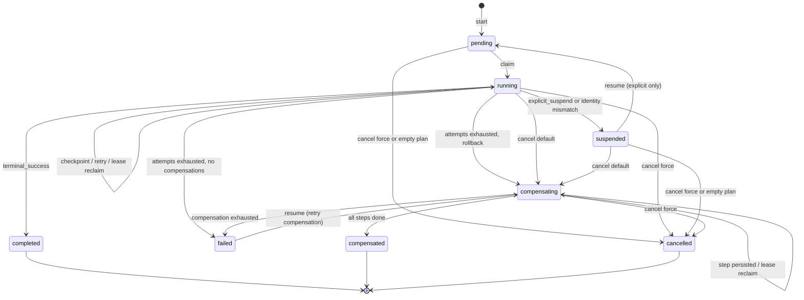
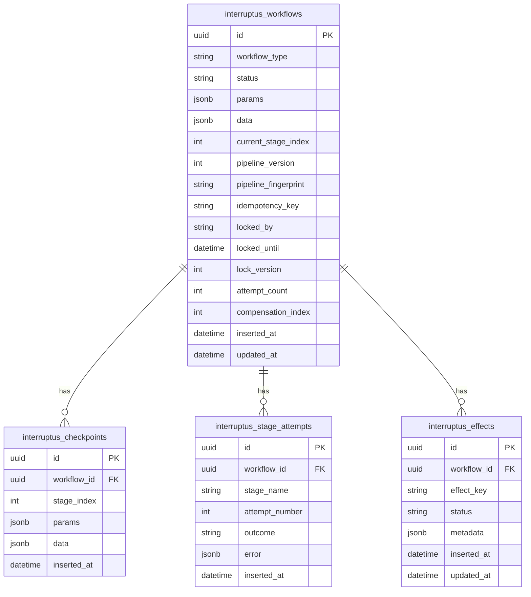

# Interruptus — Design Document

## Problem Statement

Business workflows in Elixir applications often combine multiple steps with external side effects (payments, emails, API calls). [Commandex](https://github.com/codedge-llc/commandex) provides an excellent in-process pipeline DSL but offers no durability: if the process crashes or the service restarts, work is lost and must be manually retried.

[Temporal](https://temporal.io/) solves this with a dedicated orchestration cluster, event sourcing, and activity replay. That power comes with operational complexity. Interruptus targets the middle ground: **durable Commandex-style pipelines** that run inside the host BEAM process, persist checkpoints in the host PostgreSQL database, and resume automatically after interruption—without an external orchestrator.

## Goals

1. Commandex-compatible authoring experience (`pipeline`, halt/errors) with typed `param/3` and `data/3`.
2. Checkpoint segments with idempotent `verify/1` reconciliation between boundaries.
3. Embedded persistence in the host application's database (Oban-style migrations).
4. Per-workflow-instance supervision with crash recovery.
5. Multi-node exclusivity (exactly one runner per instance cluster-wide).
6. Explicit suspend/resume for long-running or human-in-the-loop stages.
7. Configurable restart and rollback (saga) policies.

## Non-Goals (v1)

- Separate orchestration service or polyglot workers.
- Child workflow composition, cron scheduling, visual workflow designer.
- Exactly-once delivery guarantees without user-provided idempotency.
- SQLite or non-PostgreSQL storage (PostgreSQL first; adapter trait for future).

## Comparison

| Feature | Commandex | Oban | Temporal | Continuum / gen_durable | Interruptus |
|---------|-----------|------|----------|-------------------------|-------------|
| Pipeline DSL | Yes | No (jobs) | Activities/workflows | FSM / workflow code | Yes (Commandex-like) |
| Durability | No | Per-job | Full event history | Step/segment persistence | Checkpoint segments |
| In-process | Yes | Worker process | No (gRPC) | Yes (BEAM) | Yes (BEAM) |
| External verify/reconcile | No | No | Activity heartbeats | Varies | Per-checkpoint `verify/1` |
| Suspend/resume | No | No | Signals/timers | Await/signals | Explicit suspend API |
| Multi-node safety | N/A | FOR UPDATE SKIP LOCKED | Server-side | Lease + fencing | Row claim + heartbeat |
| Embedded DB | No | Yes | No | Yes | Yes |

## Core Concepts

### Workflow

A module using `Interruptus.Workflow` that defines typed params, data fields, pipeline stages, checkpoint segments, and policies. Compiled metadata drives the `Interruptus.Engine` and `Interruptus.Runner`. Each workflow generates embedded Ecto schemas for cast/load/dump at persistence boundaries.

### Stage

A single pipeline function (arity 1 or 3, Commandex-compatible). Stages between checkpoints are not individually persisted; they may re-execute on recovery.

### Checkpoint Segment

A group of stages bounded by a checkpoint marker. On reaching a checkpoint, the runner persists a snapshot of `params`, `data`, and `current_stage_index`. Each segment may define a `verify/1` function for idempotent reconciliation.

### Snapshot

JSON-serialized workflow state stored on the workflow row and appended to `interruptus_checkpoints` for audit.

### Lease and fencing

`locked_by`, `locked_until`, and `lock_version` on the workflow row. The active Runner renews the lease periodically (heartbeats run **concurrently** with stage execution, so stages longer than the lease duration do not lose it). Stale leases allow Recovery to reclaim the workflow on another node.

`lock_version` is a true fencing token:

- **Every state-changing write bumps it**: claim, checkpoint, attempt accounting, suspend, complete, fail, compensation progress, `cancel`, `resume`, and lease release.
- Lease **renewal** extends `locked_until` without bumping the version — renewal is lease maintenance, not a state change, so API writes (e.g. `cancel/2`) never race the heartbeat.
- Runner-originated writes are additionally **holder-guarded** (`locked_by = node AND locked_until > now()`), so a runner with an expired lease cannot write even before another node re-claims.
- On any `:stale_lock`, a runner stops cleanly without further writes. This is how `cancel/2` fences a live runner mid-stage.

Attempt accounting is crash-durable: `attempt_count` is persisted **before** each execution attempt of the current segment span and reset to `0` at every successful checkpoint. A workflow that crash-loops is bounded by `restart_policy.max_attempts` across process deaths and node restarts (poison pills end in rollback, not an infinite reclaim loop).

### Policies

- **Restart policy** — retry failed segments with backoff before rollback. Applies to all failure modes: `halt/2`, error tuples, raised exceptions, throws, exits, verify failures, and stage timeouts (`stage_timeout` DSL option).
- **Rollback policy** — LIFO compensation over **passed and in-flight** checkpoints (`checkpoint compensate: :undo_x` requires `verify`). The checkpoint at `current_stage_index` is included when it declares `compensate:` (tentative undo for side effects that may have applied before the durable snapshot). Compensations **must be idempotent**. The workflow-level `rollback_policy compensate: [...]` list is appended after them. Progress is persisted per step (`compensation_index`); `:compensating` workflows are reclaimable. Exhaustion yields `:failed`; `Interruptus.resume/2` retries compensation from where it stopped.

## Lifecycle



Reclaimable by Recovery after lease expiry: `pending`, `running`, `compensating`. **Never** `suspended` — suspension is explicit and only `Interruptus.resume/2` (a fenced `suspended → pending` transition) brings it back. `failed` is a resting quarantine: `resume/2` transitions it to `compensating` to retry rollback. `cancel/2` defaults to `compensate: true`; plain cancel with a non-empty plan requires `force: true`. Cancel while `:compensating` requires `force: true`.

### Start

1. Insert workflow row (`:pending`) with initial checkpoint snapshot. With an
   `:idempotency_key`, a duplicate insert returns the **existing** instance
   (idempotent start).
2. Start Runner under the per-instance `RunnerSupervisor`.
3. Runner claims the row (`FOR UPDATE SKIP LOCKED`), sets `:running`
   (preserving `:compensating` for reclaimed rollbacks), and begins execution
   from `current_stage_index`. A runner that cannot claim stops immediately.
4. If the persisted `pipeline_version` or `pipeline_fingerprint` differs from
   the compiled module, the runner parks the workflow as `:suspended` with
   reason `"pipeline_version_mismatch"` or `"pipeline_fingerprint_mismatch"`
   instead of executing positional indexes against a different pipeline layout.

### Run Segment

1. Persist `attempt_count + 1` (fenced, holder-guarded). An exhausted budget
   goes straight to rollback.
2. Execute the segment in a supervised task (`Task.Supervisor`); the runner
   GenServer keeps heartbeating while the task runs. Exceptions, throws,
   exits, invalid return values, and `stage_timeout` expiry are contained as
   failures and routed through the restart policy.
3. If the segment has `verify/1`, run it first under the same `stage_timeout`:
   `:done` skips the stages, `:not_done` runs them, `:failed` routes to the
   restart policy. Hung verify is a timeout failure.
4. On checkpoint boundary, persist snapshot + audit row in one fenced
   transaction and reset `attempt_count` to `0`.
5. On suspend, persist state and `:suspended`; release lease; stop. Prefer
   `Command.suspend/3` when mutations must be kept; the 3-tuple form keeps
   the pre-stage command.
6. On failure with remaining budget, back off, reload the row (fenced), and
   rebuild the command from the last checkpoint — the runner already holds
   the lease and does **not** re-claim. Engine errors carry the last-good
   command for same-process rollback.
7. `halt(success: true)` completes the workflow as `:completed`.

### Crash Recovery

1. Runner dies without releasing lease; `locked_until` eventually expires.
2. `Interruptus.Recovery` (per instance, jittered scans) finds reclaimable
   rows: `pending`, `running`, `compensating` — never `suspended`.
3. New Runner claims (version bump fences the old one), loads the snapshot,
   and resumes from the last checkpoint (or from `compensation_index` for
   `:compensating` rows). Rows whose `workflow_type` cannot be resolved on
   this node are parked as `:suspended` with reason `"unknown_workflow_type"`
   (and the lease cleared) so they leave the reclaim set; an operator or a
   node that loads the module can resume or cancel them. Reclaim scans use
   keyset pagination so large backlogs are not truncated to a fixed oldest-N
   window forever.

### Complete

Terminal success sets `:completed`. Recovery ignores terminal rows.

### Rollback

On failure after restart exhaustion, the compensation plan is computed from
**passed and in-flight** checkpoints (segments `0..current_stage_index`
inclusive when they declare `compensate:`) plus the workflow-level list, in
LIFO order. Compensations must be idempotent — the in-flight segment may or
may not have applied external work. Entering compensation persists the current
command snapshot (params/data/errors). Each compensation function runs in a
supervised task with the same attempt accounting; `compensation_index` (and
command state) is persisted after each completed step. Success ends
`:compensated`; exhaustion ends `:failed` (resumable to retry compensation
when the plan is non-empty). An empty plan ends `:failed` directly — nothing
was rolled back, so claiming `:compensated` would be misleading. `resume/2` on
empty-plan `:failed` returns `{:error, :not_compensable}`.

`cancel/2` defaults to compensation. With a non-empty plan it fences the row
to `:compensating`, clears the lease, **evicts** any Registry-registered
runner, and starts a fresh runner. Plain cancel (`compensate: false`) with a
non-empty plan requires `force: true`. Cancel while `:compensating` requires
`force: true`. Every successful cancel evicts any live runner.

## Data Model



## Shared database and transactions

Interruptus embeds in the host Postgres database. Stages run **outside** library transactions; checkpoint progress (workflow row + audit insert) is one short transaction after stages return.

Implications:

1. Stage side effects and Interruptus checkpoints are **not** one atomic unit.
2. Between checkpoints, stages and verify may run at-least-once — use idempotent effects, domain unique keys, `verify/1`, and `Interruptus.Effect` markers (`pending` → `applied` claim-before-apply).
3. Do not call `start` / `resume` / `cancel` inside an open transaction on the configured Interruptus repo (`{:error, :in_transaction}`). Nested calls race the Runner against an uncommitted insert.
4. `lock_version` fences workflow-row writes only. A stale runner after lease expiry can still commit host-table writes.
5. A dedicated Interruptus Repo/pool (same DB URL) is recommended under load for connection isolation; nesting detection binds to that `:repo`.

## Concurrency and Failure Scenarios

### Split-brain after lease expiry

Old runner may still be executing when lease expires. New runner claims with incremented `lock_version`. All Interruptus writes use optimistic locking on `lock_version` **and** runner writes require a currently valid lease held by the writing node; stale runner writes to workflow rows fail safely and the stale runner stops. Host-table writes are not fenced — design stages accordingly. Long stages do not cause spurious expiry: heartbeats renew concurrently with execution.

### Cancel racing a live runner

`cancel/2` bumps the fencing token and **always evicts** any registered runner.
Default `compensate: true` starts compensation when the plan is non-empty.
`compensate: false` with a non-empty plan requires `force: true`. A
`:cancelled` workflow can never be resurrected to `:completed`.

### Duplicate verify execution

Verify runs on every resume before segment stages. Must query external or durable state idempotently (e.g., payment status by idempotency key, or `Interruptus.Effect.exists?/3`).

### Stale lease / crashed node

Recovery reclaims when `locked_until < now()` (or is `NULL`) and status is `:pending`, `:running`, or `:compensating`. Suspended workflows are excluded: they resume only via `Interruptus.resume/2`.

### Deploy mid-flight

`pipeline_version` (manual) and `pipeline_fingerprint` (automatic structural
hash of flattened segments + workflow-level compensations) are stored on the
instance and enforced at claim time. A mismatch parks the workflow as
`:suspended` with reason `"pipeline_version_mismatch"` or
`"pipeline_fingerprint_mismatch"` instead of silently executing positional
stage indexes against a different pipeline. Operators resolve by deploying
compatible code and resuming, or cancelling with compensation / force.
Recovery also parks instances whose `workflow_type` does not resolve on the
scanning node.

## API Surface

```elixir
# Start a new workflow instance (idempotent with :idempotency_key)
Interruptus.start(MyApp.TransferFunds, %{from_account_id: "a", ...}, opts)

# Resume: suspended -> pending (forward) or failed -> compensating (rollback retry)
Interruptus.resume(workflow_id)

# Cancel (defaults to compensate: true; evicts live runners)
Interruptus.cancel(workflow_id)

# Abandon compensation (operator accepts inconsistent external state)
Interruptus.cancel(workflow_id, compensate: false, force: true)

# Query status
Interruptus.status(workflow_id)

# OTP child spec for the HOST application supervisor (after the Repo).
# Starts the per-instance tree: Registry, Task.Supervisor, RunnerSupervisor,
# Recovery. Multiple named instances may coexist in one VM.
{Interruptus, repo: MyApp.Repo, name: Interruptus}
```

## Open Questions / Future Work

- Workflow migration tooling when `pipeline_version` changes.
- Signal/callback API for external event delivery.
- Child workflow composition.
- SQLite adapter and storage behaviour formalization.
- Configurable retention/GC for terminal instances.
- Admin operations: `force_restart`, `replay_from_checkpoint`.
