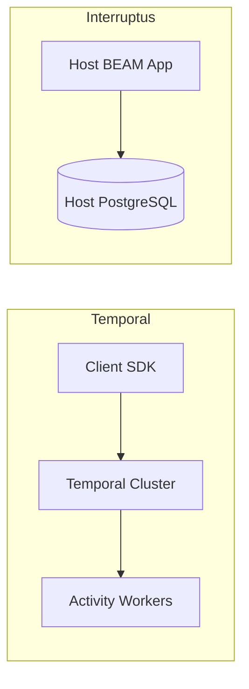
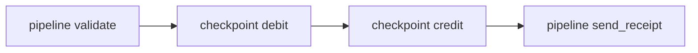
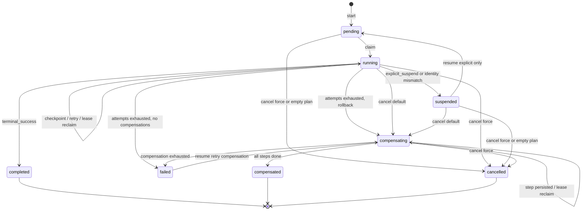
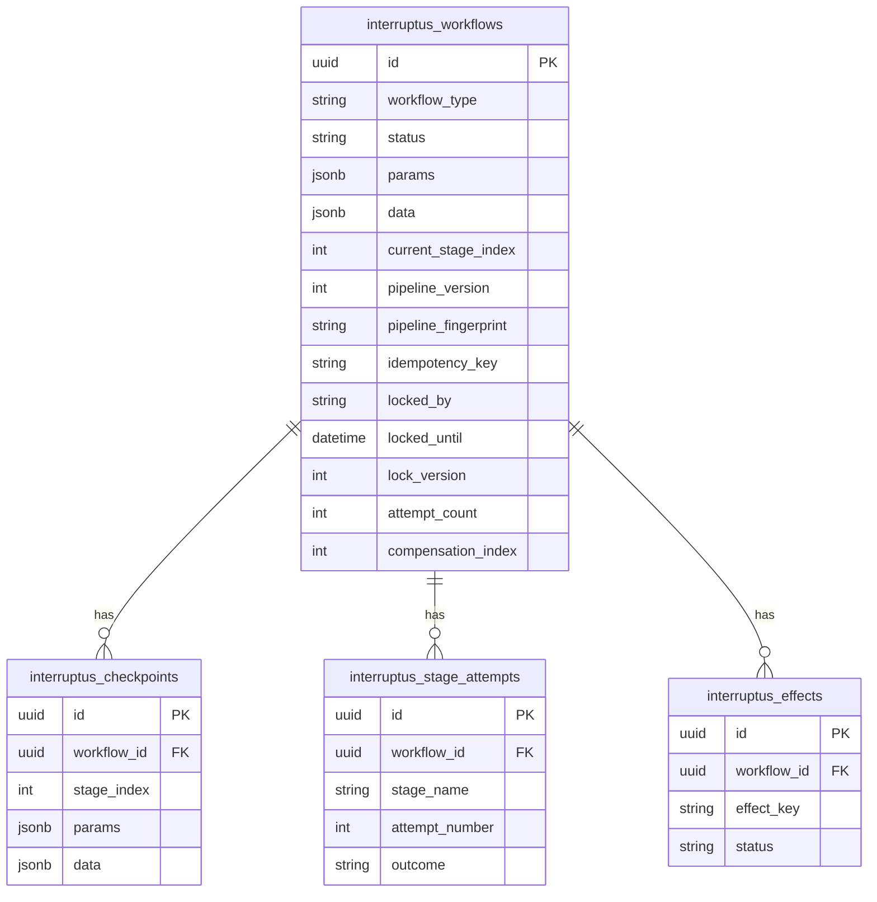
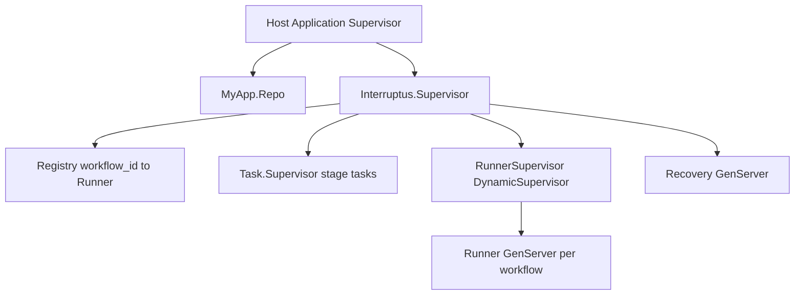
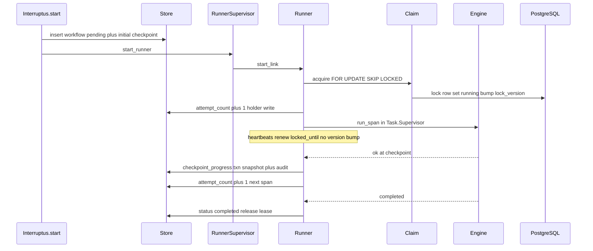
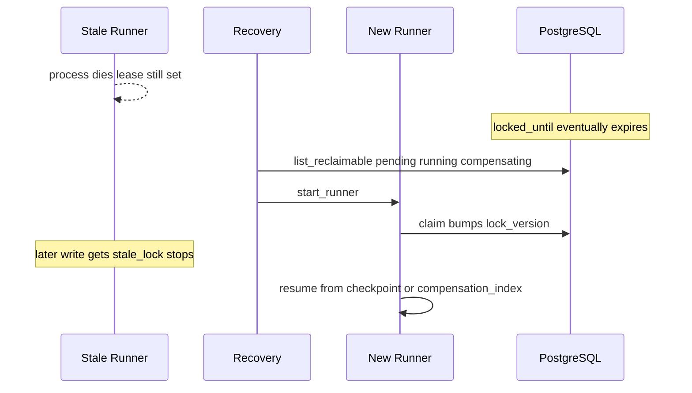

# Interruptus Guide

Durable workflow pipelines for Elixir — typed params and data, checkpoint-based persistence in your PostgreSQL database, multi-node exclusivity, and explicit suspend/resume. No external orchestrator.

This guide is for Elixir developers who need multi-step workflows with side effects that must survive crashes and deploys — especially financial and ledger-style work (transfers, settlements, approvals). For a short install path see [README.md](README.md); for architecture depth see [DESIGN.md](DESIGN.md).

---

## Table of contents

1. [Introduction](#1-introduction)
2. [Design rationale and tradeoffs](#2-design-rationale-and-tradeoffs)
3. [Installation](#3-installation)
4. [Core concepts](#4-core-concepts)
5. [Usage](#5-usage)
6. [Advanced: internals and durability](#6-advanced-internals-and-durability)

---

## 1. Introduction

### What Interruptus is

Interruptus is a library, not a platform. You embed it in your OTP application the same way you embed [Oban](https://github.com/oban-bg/oban): your app owns the PostgreSQL database and Ecto repo; Interruptus owns four tables and a small supervision tree that runs workflow *runners* on the BEAM.

You author workflows with a Commandex-style DSL (`pipeline`, typed `param`/`data`, checkpoints, verify, compensate). At runtime a runner claims a workflow row, executes stages in a supervised task, heartbeats a lease, and persists snapshots at checkpoint boundaries. If the process dies, another node (or the same node after restart) reclaims the expired lease and continues from the last durable checkpoint.

### Who it is for

- Elixir apps that already use Postgres and Ecto
- Multi-step business processes with external or DB side effects (payments, ledger posts, partner APIs)
- Teams that want saga-style compensation and human-in-the-loop suspend without operating Temporal (or similar)

### Versus Temporal (one paragraph)

[Temporal](https://temporal.io/) solves the same problem space with a dedicated orchestration cluster, durable event history, activity workers (often polyglot), and a rich operational surface (UI, schedules, queries). Interruptus targets a different ops model: **in-process on the BEAM**, durability via **checkpoint segments in the host Postgres**, cluster exclusivity via **row claim + lease**, and **explicit** suspend/resume — closer to “durable Commandex” than to “hosted workflow engine.” You trade Temporal’s history replay and polyglot workers for simpler embedding and lower operational cost, at the price of at-least-once semantics between checkpoints and fencing that covers workflow rows, not every host-table write.



---

## 2. Design rationale and tradeoffs

### Why these choices

| Decision | Reason |
|----------|--------|
| Embed in host Postgres (Oban-style) | One database to operate; migrations ship with the app; no second cluster |
| Checkpoint segments, not full event history | Smaller storage, simpler mental model; durability boundaries you choose |
| In-process runners on the BEAM | Same language/runtime as stages; OTP supervision; no gRPC worker fleet |
| Explicit suspend (never auto-reclaimed) | HITL / compliance waits must not resume by accident |
| At-least-once + `verify` / `Effect` | Honest about crash windows; gives tools to make stages safe |
| Per-checkpoint `compensate:` (LIFO, passed + in-flight) | Saga rollback that matches “what might have applied” after a crash |

### Tradeoffs (especially for financial systems)

1. **Stage writes and checkpoints are independent commits.** A debit can land in your ledger table and the process can die before Interruptus records the checkpoint. On reclaim, the segment may run again. Design for that with `verify/1`, `Interruptus.Effect`, and domain unique constraints.
2. **`lock_version` fences Interruptus workflow rows only.** A stale runner after lease expiry cannot update the workflow row, but it may still commit host-table writes until the process exits. Prefer short stages, Effect claim-before-apply, and idempotent compensations.
3. **Compensation includes in-flight checkpoints.** The segment at `current_stage_index` is compensated when it declares `compensate:` — external work may or may not have applied. Compensations **must be idempotent**.
4. **No exactly-once without your help.** Markers and verify skip work on replay; hard once-only against external systems still needs domain uniqueness or provider idempotency keys.
5. **v1 non-goals:** child workflows, cron/UI, polyglot workers, non-PostgreSQL adapters, distributed tracing beyond `:telemetry`.

### Suitable when

- The app is Elixir/BEAM-native and already runs Postgres
- Checkpoint granularity (not line-by-line history) is enough for audit and recovery
- Your team can author idempotent stages and compensations
- You want suspend/signal for approvals without a separate orchestrator

### Not suitable when

- You need polyglot activity workers or a Temporal-style cluster/UI
- You require true exactly-once delivery without application-level idempotency
- You cannot use PostgreSQL
- You need child workflows, schedules, or automatic remapping across breaking pipeline edits (operator parking + acknowledge is the v1 path)

### Comparison

| Feature | Commandex | Oban | Temporal | Continuum / gen_durable | Interruptus |
|---------|-----------|------|----------|-------------------------|-------------|
| Pipeline DSL | Yes | No (jobs) | Activities/workflows | FSM / workflow code | Yes (Commandex-like) |
| Durability | No | Per-job | Full event history | Step/segment persistence | Checkpoint segments |
| In-process | Yes | Worker process | No (gRPC) | Yes (BEAM) | Yes (BEAM) |
| External verify/reconcile | No | No | Activity heartbeats | Varies | Per-checkpoint `verify/1` |
| Suspend/resume | No | No | Signals/timers | Await/signals | Explicit suspend API |
| Multi-node safety | N/A | `FOR UPDATE SKIP LOCKED` | Server-side | Lease + fencing | Row claim + heartbeat |
| Embedded DB | No | Yes | No | Yes | Yes |

**Temporal deviation summary**

| Temporal | Interruptus | Why |
|----------|-------------|-----|
| Event-sourced workflow history; replay every step | Snapshot at checkpoints; bare stages between checkpoints re-run | Simpler storage; you own idempotency between boundaries |
| Activities are separately scheduled/heartbeated | Stages run in a Task under the runner; lease heartbeats are concurrent | One BEAM process tree; no activity worker pool |
| Signals / queries / timers as first-class | `suspend` + `signal/3` (payload under `suspend_metadata["signal"]`); no timer DSL | Explicit HITL; timers left to the host |
| Server guarantees exclusivity | Postgres claim + lease + `lock_version` | Host owns the DB; same exclusivity pattern as Oban-style jobs |
| Cancel / terminate policies in the cluster | `cancel/2` defaults to **compensate**; abandon needs `force: true` | Prefer saga undo for money movement |

---

## 3. Installation

Focused on macOS and Linux. Interruptus requires **Elixir ~> 1.15** and **PostgreSQL**.

### 3.1 Elixir and OTP

**macOS (Homebrew):**

```bash
brew install elixir
elixir -v   # expect Elixir 1.15+ and a matching OTP
```

**Linux (example: Ubuntu with the official packages or asdf):**

```bash
# asdf (recommended for version pinning)
asdf plugin add erlang
asdf plugin add elixir
asdf install erlang 27.2
asdf install elixir 1.17.3-otp-27
asdf local erlang 27.2
asdf local elixir 1.17.3-otp-27
```

Or use [mise](https://mise.jdx.dev/) similarly. Confirm:

```bash
elixir -v
mix -v
```

### 3.2 PostgreSQL

**macOS:**

```bash
brew install postgresql@16
brew services start postgresql@16
createdb interruptus_dev   # or use your app's DB name
```

**Linux:**

```bash
sudo apt install postgresql postgresql-contrib   # Debian/Ubuntu
sudo systemctl start postgresql
sudo -u postgres createuser -s "$USER"
createdb interruptus_dev
```

Library tests expect a local DB (see `config/test.exs`: database `interruptus_test`, user/password `interruptus`/`interruptus`). The example app uses `minimal_host_app_dev` with default `postgres` credentials — adjust to your environment.

### 3.3 Add the dependency

In your host app’s `mix.exs`:

```elixir
defp deps do
  [
    {:interruptus, "~> 0.1.0"},
    {:ecto_sql, "~> 3.11"},
    {:postgrex, "~> 0.22"},
    {:jason, "~> 1.4"},
    {:telemetry, "~> 1.2"}
  ]
end
```

`postgrex` is a host dependency (the library uses it in `:dev`/`:test` only). Then:

```bash
mix deps.get
```

### 3.4 Configure and supervise

```elixir
# config/config.exs
config :interruptus, Interruptus,
  repo: MyApp.Repo,
  prefix: "public",
  lease_duration: 30_000,
  heartbeat_interval: 10_000,
  recovery_interval: 5_000

# :node_id defaults to "#{Node.self()}/<random-boot-token>" — safe for
# multi-node even without distributed Erlang. Set explicitly for stable
# lease attribution across restarts if you need it.
```

Other config (see `Interruptus.Config`): `:recovery_schedule` (default `true`), `:retention_ms`, `:purge_schedule`.

```elixir
# lib/my_app/application.ex — after the Repo
children = [
  MyApp.Repo,
  {Interruptus, repo: MyApp.Repo}
]

# Under load, isolate pools (same DB URL, separate Repo module):
# children = [
#   MyApp.Repo,
#   MyApp.InterruptusRepo,
#   {Interruptus, repo: MyApp.InterruptusRepo}
# ]
```

### 3.5 Migrate

```elixir
defmodule MyApp.Repo.Migrations.AddInterruptus do
  use Ecto.Migration

  def up, do: Interruptus.Migration.up()
  def down, do: Interruptus.Migration.down()
end
```

Optional schema prefix (must match config `:prefix`):

```elixir
def up, do: Interruptus.Migration.up(prefix: "private")
def down, do: Interruptus.Migration.down(prefix: "private")
```

```bash
mix ecto.create
mix ecto.migrate
```

### 3.6 Verify the install

**From this repo:**

```bash
git clone https://github.com/erlar/interruptus.git
cd interruptus
mix setup    # deps + ecto.setup for tests
mix test
```

**Example host app:**

```bash
cd examples/minimal_host_app
mix deps.get
mix ecto.create
mix ecto.migrate
iex -S mix
```

```elixir
{:ok, workflow} =
  Interruptus.start(MinimalHostApp.Workflows.TransferFunds, %{
    from_account_id: 1,
    to_account_id: 2,
    amount: "100.00"
  })

Interruptus.status(workflow.id)
```

### 3.7 Transaction rule

Do **not** call `Interruptus.start/3`, `resume/2`, or `cancel/2` inside `Repo.transaction/2` on the Interruptus-configured repo. Those calls return `{:error, :in_transaction}` — nesting would start a Runner before the outer transaction commits. If you use a dedicated `InterruptusRepo`, nesting detection binds to that repo; still avoid nesting `start`/`resume`/`cancel` in either transaction.

---

## 4. Core concepts

### Workflow

A module that `use Interruptus.Workflow` and defines a `workflow do ... end` block: typed params/data, pipelines, checkpoints, and policies. Compilation generates cast/load/dump helpers, segment metadata, `pipeline_fingerprint`, and an in-memory `run/1` for tests.

### Params vs data vs Command

- **Params** — inputs cast and validated at `Interruptus.start/3` (required unless `default:`). Stable for the instance.
- **Data** — mutable workflow state updated by stages (`Command.put_data/3`), validated on persist.
- **Command** — the struct stages receive and return: `params`, `data`, `errors`, `halted`, `success`, plus runtime fields such as `workflow_id` when running under a Runner.

Both params and data must be JSON-serializable for persistence. `:decimal` is stored as a normalized string; after load/cast, stage code uses `Decimal`.

### Stage (pipeline)

A single function (arity 1 or 3, Commandex-compatible). Bare `pipeline :name` stages between checkpoints are **not** individually durable — they re-execute on recovery if the crash happened before the next checkpoint.

### Checkpoint segment

A group of stages bounded by `checkpoint`. Reaching a checkpoint persists params, data, and `current_stage_index` (and an audit row). Prefer checkpoints around side effects; use bare pipelines for pure validate/transform work.



### Span

The runner executes from `current_stage_index` through the next checkpoint (or pipeline end) in **one** supervised task. Bare stages in that range stay in-memory; only the checkpoint (or terminal) is the durability boundary. Heartbeats renew the lease **concurrently** with that task.

### Verify

Optional (required when `compensate:` is set). Runs before the segment’s stages under `stage_timeout`:

| Return | Meaning |
|--------|---------|
| `:done` | External work already applied — skip stages |
| `:not_done` | Run stages (at-least-once path) |
| `:failed` | Unrecoverable — restart or rollback policy |

Verify must be idempotent and must not create duplicate side effects.

### Snapshot and audit trail

The workflow row holds the current snapshot. Each successful checkpoint also inserts into `interruptus_checkpoints` for history. An **initial checkpoint** is written on `start/3`.

### Lease and fencing

| Field | Role |
|-------|------|
| `locked_by` | Holder `node_id` |
| `locked_until` | Lease expiry |
| `lock_version` | Fencing token — bumped on every state-changing write; **not** on heartbeat renew |

Only one runner cluster-wide holds an active lease (`FOR UPDATE SKIP LOCKED` on claim). Stale leases are reclaimed by `Interruptus.Recovery`.

### Restart vs rollback

- **Restart policy** — retry the current span with backoff (`max_attempts`, `:constant` / `:exponential`). Attempts are persisted **before** execution and reset at each checkpoint.
- **Rollback / compensation** — LIFO over **passed and in-flight** checkpoints with `compensate:`, then any workflow-level `rollback_policy compensate: [...]`. Progress is stored in `compensation_index` (crash-resumable).

### Effect markers

`Interruptus.Effect` stores `(workflow_id, effect_key)` rows: claim `:pending` → run work → mark `:applied` (or delete pending on failure/suspend/halt). `exists?/3` is true only for `:applied`. Use with `verify/1` for replay-safe stages. Domain uniqueness is still required for hard once-only against external systems.

### Idempotency key

`Interruptus.start(mod, params, idempotency_key: "…")` — duplicate key for the same workflow type returns the **existing** instance (original params win). Safe for client retries.

### Pipeline identity

`pipeline_version` (manual) and `pipeline_fingerprint` (automatic structural hash) are checked at claim time. Mismatch parks the instance `:suspended` instead of running positional indexes against a different layout. Unknown `workflow_type` on a node is parked similarly so reclaim is not starved.

### Lifecycle statuses



Reclaimable after lease expiry: `:pending`, `:running`, `:compensating`. **Never** `:suspended` — only `resume/2` / `signal/3`. Terminal `:completed` / `:compensated` / `:cancelled` are never restarted.

### Data model



---

## 5. Usage

Examples below are intended to compile in a host app that already supervises Interruptus and has run migrations. Adapt module names (`MyApp.…`) to your project.

### 5.1 Author a transfer workflow

Financial spine: validate → debit checkpoint → credit checkpoint → receipt, with Effect markers, verify, and per-checkpoint compensations.

```elixir
defmodule MyApp.TransferFunds do
  @moduledoc """
  Debit then credit with checkpoint verification and LIFO compensation.
  """

  use Interruptus.Workflow

  alias Interruptus.Command
  alias Interruptus.Effect

  workflow do
    param :from_account_id, :integer
    param :to_account_id, :integer
    param :amount, :decimal
    param :transfer_ref, :string

    data :debit_ref, :string
    data :credit_ref, :string

    stage_timeout 30_000

    pipeline :validate_accounts

    checkpoint :debit, compensate: :reverse_debit do
      verify :verify_debit_applied
      pipeline :debit_account
    end

    checkpoint :credit, compensate: :reverse_credit do
      verify :verify_credit_applied
      pipeline :credit_account
    end

    pipeline :send_receipt

    restart_policy max_attempts: 5, backoff: :exponential
  end

  def validate_accounts(command, params, _data) do
    cond do
      params.from_account_id == params.to_account_id ->
        command
        |> Command.put_error(:accounts, :same_account)
        |> Command.halt()

      Decimal.compare(params.amount, Decimal.new(0)) != :gt ->
        command
        |> Command.put_error(:amount, :invalid)
        |> Command.halt()

      true ->
        command
    end
  end

  def debit_account(command, params, _data) do
    key = Effect.key(["debit", params.transfer_ref])

    Effect.once(command, key, fn cmd ->
      # Apply ledger debit here (prefer a unique constraint on transfer_ref).
      ref = "debit-#{params.transfer_ref}"
      Command.put_data(cmd, :debit_ref, ref)
    end)
  end

  def credit_account(command, params, _data) do
    key = Effect.key(["credit", params.transfer_ref])

    Effect.once(command, key, fn cmd ->
      ref = "credit-#{params.transfer_ref}"
      Command.put_data(cmd, :credit_ref, ref)
    end)
  end

  def send_receipt(command, _params, _data), do: command

  def verify_debit_applied(command) do
    key = Effect.key(["debit", command.params.transfer_ref])

    cond do
      Effect.exists?(command, key) -> :done
      is_binary(command.data.debit_ref) -> :done
      true -> :not_done
    end
  end

  def verify_credit_applied(command) do
    key = Effect.key(["credit", command.params.transfer_ref])

    cond do
      Effect.exists?(command, key) -> :done
      is_binary(command.data.credit_ref) -> :done
      true -> :not_done
    end
  end

  # Compensations must be idempotent (in-flight segment may re-run after crash).
  def reverse_debit(command) do
    # Reverse or void the debit if present; no-op if already reversed.
    command
  end

  def reverse_credit(command) do
    command
  end
end
```

Compared to Temporal activities: there is no separate activity completion record. Durability is the checkpoint after debit/credit. Between checkpoints, replay is expected — that is why `verify` + `Effect.once` exist.

### 5.2 Start, status, and idempotent retries

```elixir
params = %{
  from_account_id: 1,
  to_account_id: 2,
  amount: "100.00",
  transfer_ref: "xfer-2026-00042"
}

{:ok, workflow} =
  Interruptus.start(MyApp.TransferFunds, params, idempotency_key: "xfer-2026-00042")

# Client retry with the same key returns the same instance (original params win).
{:ok, ^workflow} =
  Interruptus.start(MyApp.TransferFunds, params, idempotency_key: "xfer-2026-00042")

{:ok, instance} = Interruptus.status(workflow.id)
instance.status
# => :pending | :running | :completed | ...

{:ok, name} = Interruptus.segment_name(workflow.id)
```

If the row commits but the runner cannot start immediately, `start/3` still returns `{:ok, instance}`; Recovery reclaims lease-less `:pending` rows.

### 5.3 Stage return values

| Return | Behavior |
|--------|----------|
| Command struct | Continue |
| `{:suspend, reason, metadata}` | Suspend with **pre-stage** command |
| `Command.suspend(cmd, reason, metadata)` | Suspend **keeping** mutations on `cmd` |
| `Command.halt(cmd)` | Stop forward progress → restart or rollback |
| `Command.halt(cmd, success: true)` | Durable early exit → `:completed` (no compensation) |
| `{:error, reason}` / `{:error, reason, cmd}` | Failure (3-tuple carries last-good command into compensation) |
| Raise / throw / exit / invalid return / timeout | Contained → restart policy |

```elixir
defmodule MyApp.EarlyComplete do
  use Interruptus.Workflow

  alias Interruptus.Command

  workflow do
    param :already_settled, :boolean, default: false
    data :note, :string

    pipeline :maybe_finish
    restart_policy max_attempts: 1
  end

  def maybe_finish(command, %{already_settled: true}, _data) do
    command
    |> Command.put_data(:note, "noop")
    |> Command.halt(success: true)
  end

  def maybe_finish(command, _params, _data), do: command
end
```

### 5.4 Suspend, resume, and signal (HITL)

Unlike Temporal signals that can be buffered onto a running workflow, Interruptus suspension is voluntary: the stage returns suspend, the runner persists `:suspended` and **stops**. Recovery never auto-resumes.

- `resume/2` — fenced `:suspended → :pending`, clears `suspend_reason` / `suspend_metadata`
- `signal/3` — merges a payload into `suspend_metadata["signal"]`, then resumes to `:pending` **preserving** that metadata on the workflow row (readable via `Interruptus.status/2`). The command struct does not carry `suspend_metadata`; stages that need the signal should load it from status (or use a domain approval store, as in the test suite).

```elixir
defmodule MyApp.WireTransfer do
  use Interruptus.Workflow

  alias Interruptus.Command

  workflow do
    param :amount, :decimal
    param :requires_approval, :boolean, default: true

    data :approved_by, :string
    data :debit_ref, :string

    pipeline :prepare

    checkpoint :await_ops, compensate: :noop_prepare do
      verify :verify_approved
      pipeline :await_approval
    end

    checkpoint :debit, compensate: :reverse_debit do
      verify :verify_debit
      pipeline :post_debit
    end

    restart_policy max_attempts: 3, backoff: :exponential
  end

  def prepare(command, _params, _data), do: command

  def verify_approved(command) do
    if is_binary(command.data.approved_by), do: :done, else: :not_done
  end

  def await_approval(command, params, _data) do
    cond do
      not params.requires_approval ->
        Command.put_data(command, :approved_by, "auto")

      signal_approved?(command) ->
        by = get_in(signal_payload(command), ["by"]) || "ops"
        Command.put_data(command, :approved_by, by)

      true ->
        # Prefer Command.suspend/3 when you mutate before waiting:
        # updated = Command.put_data(command, :note, "waiting")
        # Command.suspend(updated, :await_approval, %{amount: params.amount})
        {:suspend, :await_approval, %{amount: params.amount}}
    end
  end

  def verify_debit(command) do
    if is_binary(command.data.debit_ref), do: :done, else: :not_done
  end

  def post_debit(command, _params, _data) do
    Command.put_data(command, :debit_ref, "debit-1")
  end

  def noop_prepare(command), do: command
  def reverse_debit(command), do: command

  defp signal_approved?(command) do
    Map.get(signal_payload(command), "approved") == true
  end

  defp signal_payload(command) do
    case Interruptus.status(command.workflow_id) do
      {:ok, %{suspend_metadata: %{"signal" => signal}}} when is_map(signal) -> signal
      _ -> %{}
    end
  end
end
```

Operator / callback API:

```elixir
{:ok, wf} =
  Interruptus.start(MyApp.WireTransfer, %{
    amount: "5000.00",
    requires_approval: true
  })

# ... workflow reaches :suspended ...

{:ok, _pid} =
  Interruptus.signal(wf.id, %{approved: true, by: "alice@ops"})

# Keys are stringified in metadata: %{"approved" => true, "by" => "alice@ops"}
# Plain resume (no payload; clears suspend_metadata):
# Interruptus.resume(wf.id)
```

**Suspend with mutations:** `{:suspend, reason, meta}` keeps the **pre-stage** command. If the stage already updated `data`, use `Command.suspend/3`:

```elixir
def mutate_then_wait(command, _params, _data) do
  updated = Command.put_data(command, :note, "kept")
  Command.suspend(updated, :await, %{})
end
```

### 5.5 Cancel, compensate, abandon, retry compensation

Cancel **defaults to compensate** (`compensate: true`), always evicts any live runner, and bumps the fencing token.

```elixir
# Prefer intent helpers
Interruptus.compensate(workflow_id)           # cancel with compensate: true
Interruptus.abandon(workflow_id)             # compensate: false, force: true → :cancelled
Interruptus.retry_compensation(workflow_id)  # resume only if :failed

# Explicit options
Interruptus.cancel(workflow_id)                              # default compensate
Interruptus.cancel(workflow_id, compensate: false, force: true)
```

Rules:

- Non-empty compensation plan + plain cancel (`compensate: false`) → requires `force: true` or you get `{:error, :compensation_required}`
- Cancel while `:compensating` → requires `force: true`
- Empty plan → cancel ends `:cancelled` (or failure path ends `:failed`, not `:compensated`)
- `:failed` with a non-empty plan → `resume/2` enters `:compensating`; empty plan → `{:error, :not_compensable}`

### 5.6 Restart policy and timeouts

```elixir
workflow do
  # ...
  stage_timeout 30_000   # stages, verify, and compensations; or :infinity

  restart_policy max_attempts: 5,
                 backoff: :exponential,   # or :constant
                 base_interval: 1_000,
                 retryable_errors: :all   # or an allow-list of errors
end
```

`attempt_count` is written **before** the span runs. Crash loops are bounded across process deaths; exhaustion enters rollback (or `:failed` if nothing is compensable). The same budget bounds compensation step retries.

### 5.7 Typed fields and Decimal

```elixir
workflow do
  param :amount, :decimal
  param :currency, Ecto.Enum, values: [:usd, :eur], default: :usd
  data :posted_at, :utc_datetime_usec
  data :memo, :string, default: "unset"
end
```

- Params are cast at start; missing required params fail validation.
- On load, **absent** JSON keys are omitted so declared `default:` values survive `Map.merge`; explicit JSON `null` loads as `nil` and overrides defaults.
- Prefer string amounts at the API boundary (`"100.00"`); stages use `Decimal`.

### 5.8 Shared-database safety pattern

Stages run **outside** Interruptus transactions. Recommended pattern for money movement:

1. Domain unique constraint (or provider idempotency key) on the business operation
2. `Effect.once/4` around the apply path
3. `Effect.exists?/3` (or a domain query) inside `verify/1`
4. Idempotent `compensate:` functions

```elixir
def verify_debit(command) do
  key = Effect.key(["debit", command.params.transfer_ref])
  if Effect.exists?(command, key), do: :done, else: :not_done
end

def debit_account(command, params, _data) do
  key = Effect.key(["debit", params.transfer_ref])

  Effect.once(command, key, fn cmd ->
    # INSERT ledger entry with unique (transfer_ref, leg) — handle conflict as success
    Command.put_data(cmd, :debit_ref, params.transfer_ref)
  end)
end
```

Stale `:pending` effect markers older than the lease duration may be reclaimed. Concurrent callers serialize on the unique `(workflow_id, effect_key)`.

### 5.9 Deploy skew and parked workflows

If compiled `pipeline_version` / `pipeline_fingerprint` disagree with the row at claim time, the runner parks `:suspended` (reasons like `"pipeline_version_mismatch"` / `"pipeline_fingerprint_mismatch"`). Unknown modules park as `"unknown_workflow_type"`.

**Operator runbook**

```elixir
parked = Interruptus.list_parked(limit: 100)
# optional: reasons: ["pipeline_fingerprint_mismatch"]

# Prefer compensate when the new layout is breaking:
Interruptus.compensate(id)

# Or accept the new identity after a compatible deploy (does NOT resume):
{:ok, _} = Interruptus.acknowledge_pipeline(id, force: true)
{:ok, _} = Interruptus.resume(id)
```

Acknowledging a **breaking** layout change can execute the wrong stages — prefer compensate when unsure. Temporal’s worker versioning is richer; Interruptus parks and waits for an operator.

### 5.10 Retention

```elixir
# From cron / Oban:
Interruptus.purge_terminal(older_than: 30 * 24 * 60 * 60 * 1000)
# or older_than: ~U[2026-01-01 00:00:00Z]
# opts: statuses: [:completed, :compensated, :cancelled], limit: 1000

# Or during Recovery scans:
config :interruptus, Interruptus,
  repo: MyApp.Repo,
  retention_ms: 30 * 24 * 60 * 60 * 1000,
  purge_schedule: true
```

Children (`checkpoints`, `stage_attempts`, `effects`) cascade on delete.

### 5.11 Testing durability

```elixir
{:ok, %{id: id}} = Interruptus.start(MyApp.TransferFunds, params)

assert {:ok, %{status: :completed}} =
         Interruptus.Test.await_status(id, :completed)

# Crash + reclaim path:
:ok = Interruptus.Test.await_runner(id)
:ok = Interruptus.Test.crash_runner(id)
:ok = Interruptus.Test.expire_lease(config, id)
:ok = Interruptus.Recovery.recover_all(config)

assert {:ok, %{status: :completed}} =
         Interruptus.Test.await_status(id, :completed)
```

For in-memory Effect tests without a runner, `Interruptus.Test.assign_workflow_id/2` attaches an id to the command. See `Interruptus.Test` for `assert_checkpoint/3`, `assert_effect_applied/3`, and related helpers.

---

## 6. Advanced: internals and durability

### 6.1 OTP supervision tree

Host starts `{Interruptus, repo: MyApp.Repo}` **after** the Repo. That boots `Interruptus.Supervisor`, stores `Config` in `:persistent_term`, and starts children (`:one_for_one`):



Process names derive from config `:name` via `Module.concat/2` (default `Interruptus.Registry`, `Interruptus.TaskSupervisor`, `Interruptus.RunnerSupervisor`, `Interruptus.Recovery`). Multiple named instances can coexist in one VM.

- **Registry** — at most one Runner pid per workflow id **per VM**; cluster exclusivity is the DB lease, not a distributed registry.
- **Runner** — `:temporary` GenServer; DynamicSupervisor does **not** restart it. Crash → lease expiry → Recovery starts a new runner.
- **Tasks** — stage/compensation spans run under `Task.Supervisor` (`async_nolink`) so the GenServer can heartbeat during long work.
- **`node_id`** — `"#{Node.self()}/#{boot_token}"` with a random per-boot token so `nonode@nohost` nodes stay distinct across restarts.

### 6.2 Claim → execute → checkpoint



**Claimable statuses:** `:pending`, `:running`, `:compensating` with expired or null lease. `:suspended` and terminals are not reclaimable by Recovery.

**Identity check** after claim: version/fingerprint mismatch → park `:suspended`, release lease, stop.

### 6.3 When data is written

| Event | Tables / columns |
|-------|------------------|
| `start/3` | `interruptus_workflows` insert (`:pending`) + initial `interruptus_checkpoints` row |
| Claim | Workflow: `:running` (or keep `:compensating`), `locked_by`, `locked_until`, `lock_version++` |
| Heartbeat renew | `locked_until` only — **no** `lock_version` bump |
| Begin attempt | `attempt_count++` (before execution) |
| Checkpoint success | Holder update (index, params, data, `attempt_count=0`) + checkpoint audit insert — one txn |
| Suspend | Status `:suspended`, snapshot, clear lease |
| Complete | `:completed`, clear lease |
| Enter compensation | `:compensating`, persist params/data/errors, plan from index |
| Compensation step | `compensation_index++`, command snapshot |
| Effect.once | `interruptus_effects` pending → applied (or delete pending) |
| Stage failure paths | Often `interruptus_stage_attempts` outcome log |
| Cancel / resume / signal | Fenced API write (`lock_version++`); cancel always evicts runner |
| Purge | Delete terminal workflow rows (cascade children) |

### 6.4 Fencing rules

| Operation | Bumps `lock_version`? | Notes |
|-----------|----------------------|--------|
| Acquire | Yes | Sets lease |
| Renew | **No** | Lease maintenance only |
| Release / holder updates / API updates | Yes | Checkpoints, attempts, cancel, resume, signal, acknowledge |
| Runner holder writes | Yes + live lease required | Expired holder cannot mutate the row |

On `:stale_lock`, the runner stops cleanly. That is how `cancel/2` fences a live mid-stage runner for **workflow-row** updates. Host-table writes from that process are not fenced.

### 6.5 Engine model

Flattened segments:

- `%{type: :stage, ...}` — bare pipeline, no verify
- `%{type: :checkpoint, verify, pipelines, compensate}` — `compensate:` requires `verify` at compile time

`Engine.run_span/…` runs bare stages in memory until a checkpoint succeeds, suspend/halt/error, or end of pipeline. One Task = one attempt span = one durability boundary.

Compensation plan (`Policy.Rollback`): checkpoints in `0..current_stage_index` **inclusive** with `compensate:` (reversed), then workflow-level `rollback_policy` list (reversed). Applied one function at a time with durable `compensation_index`.

### 6.6 Crash recovery



Recovery scans are jittered (`recovery_interval` + up to ~20% jitter), keyset-paginated, and never touch `:suspended`. Unresolvable `workflow_type` → park `"unknown_workflow_type"` so the row leaves the reclaim set.

### 6.7 Durability guarantees (and your obligations)

Interruptus provides these invariants:

1. **At-least-once between checkpoints** — stages and verify may re-run after a crash.
2. **JSON-serializable state** — params/data must dump to JSONB.
3. **Fenced workflow-row writes** — every state change bumps `lock_version` (except renew); runner writes also require a live matching lease.
4. **Terminal immutability** — `:completed`, `:compensated`, `:cancelled` are never restarted.
5. **One active runner cluster-wide** — claim + lease + fencing.
6. **Initial checkpoint on start.**
7. **No nested API transactions** on the configured Interruptus repo.
8. **Attempts persisted pre-execution** — crash loops bounded by `max_attempts`, then rollback or `:failed`.
9. **Suspension requires explicit resume/signal** — Recovery never auto-resumes.
10. **Identity-checked claims** — version/fingerprint/unknown type park instead of mis-executing.
11. **Cancel defaults to compensate** — force required to abandon or interrupt compensating.
12. **Error 3-tuples carry last-good command** into compensation; entering compensation persists the snapshot.
13. **Effect claim-before-apply** — pending → applied; `exists?` only for applied.

**You must still:**

- Make stage side effects and compensations idempotent
- Use domain uniqueness / provider idempotency for hard once-only
- Keep stages reasonably short or rely on heartbeats + Effect for long external calls
- Treat in-flight compensation as “maybe applied”
- Not assume host-table writes are fenced by `lock_version`

This differs from Temporal’s model, where workflow code is replayed against a complete event history and activity completion is recorded centrally. Interruptus records **snapshots at checkpoints**; everything between is a replay window you design for.

### 6.8 Cancel racing a live runner

`cancel/2` bumps `lock_version`, clears the lease intent via fenced update, **always evicts** the Registry runner, and with default compensate starts a fresh runner in `:compensating` when the plan is non-empty. The old process may still be finishing a stage; its next Interruptus write fails `:stale_lock`. External side effects already in flight may still complete — another reason Effect + verify + domain uniqueness matter.

### 6.9 Telemetry (brief)

Events under `[:interruptus, …]` include workflow `:started`, `:resumed`, `:signaled`, `:cancelled`, `:checkpoint`, `:completed`, `:suspended`, `:retry`, `:compensating`, `:compensated`, `:failed`, `:claimed`, `:version_mismatch`, `:fenced`, `:purged`, `:pipeline_acknowledged`, `:runner_start_failed`, recovery `:unknown_workflow_type`, and runner `:terminate`. Attach handlers with `:telemetry.attach/4` as you would for Oban.

### 6.10 Key modules

| Concern | Module |
|---------|--------|
| Public API | `Interruptus` |
| DSL | `Interruptus.Workflow` |
| Command helpers | `Interruptus.Command` |
| Effects | `Interruptus.Effect` |
| OTP tree | `Interruptus.Supervisor` |
| Runner | `Interruptus.Runner` |
| Claim / lease | `Interruptus.Claim` |
| Persistence | `Interruptus.Store` |
| Execution | `Interruptus.Engine` |
| Reclaim | `Interruptus.Recovery` |
| Policies | `Interruptus.Policy.Restart`, `Interruptus.Policy.Rollback` |
| Schema migrations | `Interruptus.Migration` |
| Test helpers | `Interruptus.Test` |

---

## Further reading

- [README.md](README.md) — quick start
- [DESIGN.md](DESIGN.md) — architecture, concurrency scenarios, API surface
- [AGENTS.md](AGENTS.md) — contributor/agent context and invariants
- [`examples/minimal_host_app`](examples/minimal_host_app) — runnable TransferFunds host
